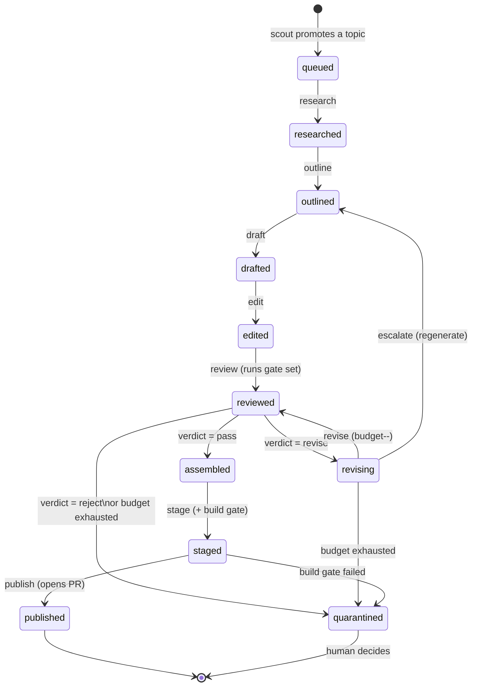

# Autonomous Content Production System — Architecture

**Status:** design proposal, nothing implemented
**Target repo:** Rootconverter (Vite + React SPA, ~30 client-side tools, markdown blog)
**Author:** architecture pass, 2026-08-07

---

## 0. Constraints this design is built around

These come from inspecting the actual repo, not from assumptions. They drive several
non-obvious decisions later, so they're stated up front.

| Constraint | Source | Consequence |
| --- | --- | --- |
| Cloudflare auto-deploys on push to `master` | `wrangler.jsonc`, Git-connected Pages | A commit **is** a publish. There is no staging environment. Publishing must be gated. |
| No CI exists (`.github/` absent) | repo root | Cron/automation has no home yet. Pipeline must run locally first, CI later, with no redesign. |
| No `.env` handling; `.gitignore` covers `*.local` but not `.env` | `.gitignore` | Pipeline must bring its own secret handling **and** amend `.gitignore`. |
| Root `package.json` deps are reachable by the browser bundle | Vite builds from `src/` with root deps | Pipeline deps (SDK, linters, validators) **must not** live in root `package.json`. |
| `oxlint` lints the entire repo | observed output linting `public/tesseract/` | Pipeline dir needs an ignore entry or it adds permanent lint noise. |
| Blog content = `src/content/blog/*.md`, auto-discovered via `import.meta.glob` | `src/blog/blogUtils.js` | The publish contract is *"a valid `.md` file in that directory"*. Nothing else. That's the entire integration surface. |
| Categories come from `src/tools/registry.js` | `CATEGORIES` | Content taxonomy is already defined. The pipeline must read it, never duplicate it. |
| `jsonrepair` is already a dependency | `package.json` | Reuse it for malformed LLM JSON before spending a retry call. |

---

## 1. Challenges to the brief

The brief asked me to challenge assumptions. Nine points, ordered by how much
money or damage they save.

### 1.1 "Autonomous publishing" + auto-deploy is the wrong risk to take

A commit to `master` goes live in ~60 seconds with no review. A fully autonomous
publisher means an LLM can put unreviewed text on a production domain.

Beyond the obvious quality risk, there's a concrete SEO one: Google's
scaled-content-abuse policy explicitly targets mass-produced content published
without human oversight or added value. A 30-tool site that suddenly grows
hundreds of AI articles is the textbook pattern for a manual action. The
*content* may be fine; the *publication pattern* is what gets flagged.

**Recommendation:** be autonomous in **production**, gated at **publication**.
The pipeline runs unattended all the way to a staged, fully-validated, build-verified
markdown file and opens a pull request. A human merges. That single gate costs ~30
seconds per article and removes essentially all catastrophic downside. It also
converts "publish" from an irreversible action into a reviewable diff.

This is the most important recommendation in this document.

### 1.2 An LLM "Fact Check" agent is mostly theatre

An LLM asked to fact-check another LLM's output, with no external ground truth,
largely agrees with itself. It reliably catches internal self-contradiction and
nothing else. Confidently-wrong claims survive, because both models share the
same priors.

For *this* site, most factual claims are checkable **deterministically**, because
they're claims about your own tools: "the JSON Formatter supports minification",
"the Base64 tool runs client-side", "we have a UUID generator". Those can be
verified against `registry.js` and the tool source. That's free, fast, and 100%
reliable — and it's where the majority of factual errors will actually occur,
because a model hallucinating your product's features is far more likely than it
misremembering what Base64 is.

**Recommendation:** replace "Fact Check Agent" with a two-part **Verification
Gate**:
- `verify:internal` — deterministic, repo-grounded. Zero LLM cost. Always runs.
- `verify:external` — claim extraction + retrieval grounding with citations.
  Expensive and slow. Reserved for articles flagged as claim-dense.

### 1.3 A dedicated LLM "Grammar Review" agent is near-pure waste

Modern models don't produce grammatically broken English. Spending a full
review call to confirm that is paying frontier prices for a null result.
Deterministic prose linters (`retext`, `write-good`, `textlint`) catch mechanical
issues — passive voice, weasel words, repeated words, sentence length — at zero
marginal cost and with perfect consistency.

**Recommendation:** delete the Grammar agent. Run deterministic prose linting as a
Tier-1 gate, and fold anything genuinely editorial (voice, rhythm, house style,
cutting filler) into a single **Editor** pass that was going to run anyway.

### 1.4 "Research Agent" is pointed at the wrong target

Generic web research produces generic articles that rank nowhere, because
they're a worse version of content that already outranks you. The
differentiated angle available to this site is grounding in **what your tools
actually do** and **where your corpus has gaps**.

Also: topic selection is a *corpus-level* concern, not a per-article one. Deciding
what to write next requires knowing everything already written. That's a
different job from researching one chosen topic.

**Recommendation:** split into two agents at different scopes.
- **Topic Scout** — runs over the whole corpus + registry. Finds coverage gaps,
  orphaned tools with no articles, internal-link deserts. Produces a ranked backlog.
- **Researcher** — runs per-article. Gathers external sources *and* extracts the
  target tool's real behaviour from its source.

### 1.5 The loop-back design will infinite-loop and burn money

"If any review fails, send it back for improvement" with no bound is an unbounded
spend loop. Worse, the common naive implementation — re-prompting with "make it
better" — produces oscillation, where fixing the SEO gate breaks the editorial
gate and vice versa, forever.

**Recommendation:** three controls.
1. **Bounded budget** — max revisions per gate (2) and per job (4), configurable.
2. **Diff-scoped revision** — the revise prompt receives *only the specific
   findings*, with locations, and is instructed to make minimal targeted edits.
   Not "improve the article."
3. **Escalation ladder** — revise → revise with stronger model → regenerate from
   outline → quarantine for human. Never an unbounded retry.

### 1.6 "Agents" and "pipeline steps" are not the same thing

The brief treats them as synonymous. Conflating them is why these systems end up
calling an LLM for work a regex could do.

**Recommendation:** three distinct concepts.
- **Step** — the unit of execution. Reads input, does one job, writes output, exits.
  Resumable and idempotent. This is what the CLI runs.
- **Agent** — a step that happens to be LLM-backed. A *subset* of steps.
- **Gate** — a step that emits a pass/revise/reject verdict. May be deterministic
  (most should be) or LLM-backed.

Roughly half the steps in this design need no LLM at all. That's the point.

### 1.7 Internal linking must be a corpus-level pass, not per-article

An article linked at write time can only link *backwards*, to what already
exists. Article #1 never gains a link to article #50. Over time this produces a
link graph where old content is well-linked and new content is orphaned — the
exact inverse of what you want, since new content needs the equity most.

**Recommendation:** a separate `link:reconcile` step that runs across the entire
corpus, recomputes the link graph, and may **amend existing published articles**
to add links to newer ones. It runs on a schedule, not per-job.

### 1.8 What's described is a state machine, so build one explicitly

"Every step can run independently: read input, do one job, write output, exit"
is the definition of a state machine over persisted state. Building it implicitly
(as a chain of scripts that happen to run in order) loses resumability, audit
trail, and parallelism.

**Recommendation:** make it explicit. A job is a **directory**. State lives in
`job.json`. Steps are transitions. An append-only `events.jsonl` records every
transition, token count, and cost. This gives resumability, debuggability,
parallel execution, and replay for free.

### 1.9 Reproducibility must be designed in, not added later

When output quality drops, the first question is "what changed?" Without recording
model ID, prompt version, temperature, and parameters per step, that question is
unanswerable and you're debugging by vibes.

**Recommendation:** every LLM call records `{model, promptId, promptVersion,
temperature, inputHash, tokensIn, tokensOut, costUsd, latencyMs}` into the job's
event log. Prompts are versioned files; the version is part of the record.

---

## 2. Folder structure

The pipeline is a **sibling workspace**, not part of `src/`. This is non-negotiable
given the constraints in §0: pipeline dependencies must never enter the browser
bundle's dependency graph.

```
converters/
├── package.json                  # + "workspaces": ["content-pipeline"]
├── .gitignore                    # + .env, content-pipeline/data/
├── .oxlintrc.json                # + ignorePatterns for content-pipeline
├── src/                          # the website — pipeline never imports from here
│   ├── content/blog/*.md         #   ← the ONLY thing the pipeline writes
│   └── tools/registry.js         #   ← the pipeline reads this (via adapter)
│
└── content-pipeline/
    ├── package.json              # own deps: SDK, ajv, retext, gray-matter…
    ├── README.md                 # operator guide: how to run, debug, extend
    ├── .env.example
    │
    ├── config/
    │   ├── pipeline.config.js    # step graph, budgets, concurrency, feature flags
    │   ├── models.js             # tier → model mapping (see §5.4)
    │   ├── thresholds.js         # per-gate pass scores, revision budgets
    │   └── house-style.md        # voice/tone spec, injected into writer+editor
    │
    ├── prompts/                  # versioned, code-free (see §6)
    │   ├── topic-scout/v1.md
    │   ├── researcher/v1.md
    │   ├── outliner/v1.md
    │   ├── writer/v1.md
    │   ├── editor/v1.md
    │   ├── seo-reviewer/v1.md
    │   ├── verifier/v1.md
    │   ├── linker/v1.md
    │   └── reviser/v1.md
    │
    ├── schemas/                  # JSON Schema, the contracts between steps
    │   ├── job.schema.json
    │   ├── topic.schema.json
    │   ├── research.schema.json
    │   ├── outline.schema.json
    │   ├── draft.schema.json
    │   ├── verdict.schema.json   # ← uniform gate output envelope
    │   └── frontmatter.schema.json
    │
    ├── src/
    │   ├── cli.js                # single entry: `pipeline <command> [args]`
    │   │
    │   ├── core/
    │   │   ├── job.js            # create/load/transition a job
    │   │   ├── store.js          # persistence INTERFACE (swap fs → db later)
    │   │   ├── events.js         # append-only event log writer
    │   │   ├── machine.js        # state machine: legal transitions
    │   │   ├── lock.js           # per-job lock, safe concurrency
    │   │   ├── budget.js         # cost accounting + hard stops
    │   │   └── errors.js         # typed errors (see §7)
    │   │
    │   ├── llm/
    │   │   ├── client.js         # provider wrapper — the ONLY provider seam
    │   │   ├── router.js         # tier → model, with escalation
    │   │   ├── structured.js     # schema-enforced output + jsonrepair fallback
    │   │   ├── retry.js          # transport-layer backoff
    │   │   └── cost.js           # token → USD
    │   │
    │   ├── prompt/
    │   │   ├── loader.js         # load prompts/<id>/v<N>.md + parse its header
    │   │   └── render.js         # variable interpolation
    │   │
    │   ├── steps/                # one file per step, all same shape (see §3.2)
    │   │   ├── scout.js
    │   │   ├── research.js
    │   │   ├── outline.js
    │   │   ├── draft.js
    │   │   ├── edit.js
    │   │   ├── review.js         # runs the configured gate set
    │   │   ├── revise.js
    │   │   ├── assemble.js       # structured data → final .md
    │   │   ├── stage.js          # write to staging + verify site builds
    │   │   └── publish.js        # branch + commit + open PR
    │   │
    │   ├── gates/                # all export: (ctx) => Verdict
    │   │   ├── frontmatter.gate.js
    │   │   ├── links.gate.js     # relatedTools/relatedArticles must resolve
    │   │   ├── markdown.gate.js  # parses, heading order, no h1, fenced langs
    │   │   ├── dedup.gate.js     # similarity vs existing corpus
    │   │   ├── prose.gate.js     # retext/write-good
    │   │   ├── seo.gate.js       # LLM
    │   │   ├── editorial.gate.js # LLM
    │   │   ├── verify-internal.gate.js  # claims vs registry — deterministic
    │   │   ├── verify-external.gate.js  # retrieval-grounded — optional
    │   │   └── build.gate.js     # runs `npm run build` for real
    │   │
    │   ├── corpus/
    │   │   ├── index.js          # load all articles + tools into memory
    │   │   ├── coverage.js       # gap analysis for the scout
    │   │   └── graph.js          # internal link graph
    │   │
    │   └── adapters/
    │       └── site.js           # ★ THE ONLY module that knows ../src paths
    │
    └── data/                     # gitignored — runtime state
        ├── backlog/topics.json
        ├── jobs/<job-id>/
        │   ├── job.json
        │   ├── events.jsonl
        │   └── artifacts/*.json
        ├── staging/*.md          # validated, awaiting PR
        ├── cache/                # research/corpus cache
        └── reports/
```

### Why `adapters/site.js` exists

Exactly one file knows where the website keeps its content, what the frontmatter
schema is, and how to read `registry.js`. Everything else in the pipeline talks to
the site through it.

If the blog moves directories, or frontmatter gains a field, or the site migrates
to a CMS — one file changes. Without this seam, path knowledge smears across
twenty modules and the pipeline becomes permanently welded to today's layout.

---

## 3. Pipeline architecture

### 3.1 A job is a directory, states are explicit



Terminal states: `published`, `quarantined`, `abandoned`.

**Why a directory per job:** it's inspectable with `ls` and `cat`, diffable,
trivially resumable, needs no database, and survives a crash mid-run. When
something goes wrong at 3am you read `events.jsonl` and know exactly what happened.
A database buys nothing at this volume and costs operability.

### 3.2 Every step has the same shape

```
step(jobId) →
  1. acquire lock
  2. load job.json, assert current state is legal for this step
  3. load required input artifacts (declared, validated against schema)
  4. do exactly one job
  5. validate output against schema
  6. write output artifact + append events
  7. transition state
  8. release lock, exit with code 0/1
```

Consequences that fall out of this shape for free:
- **Independently runnable** — `pipeline draft <job-id>` works standalone.
- **Resumable** — re-run any step; prior artifacts are still there.
- **Idempotent** — re-running a completed step with unchanged inputs is a no-op
  (compare input hash), unless `--force`.
- **Testable** — a step is a pure-ish function over a directory. Fixtures in,
  artifacts out. No mocking of an orchestrator required.
- **Parallelisable** — different jobs are different directories; the lock file
  handles the rest.

### 3.3 The runner is deliberately thin

```bash
pipeline scout                       # corpus → ranked topic backlog
pipeline enqueue <topic-id>          # backlog → new job (or --auto for top N)
pipeline run <job-id>                # advance until terminal or blocked
pipeline run <job-id> --step draft   # run exactly one step
pipeline run --all --limit 5         # advance every open job, bounded
pipeline status [<job-id>]           # human-readable state
pipeline inspect <job-id> <artifact> # dump an artifact
pipeline retry <job-id> --from outline
pipeline quarantine list|release <job-id>
pipeline link:reconcile              # corpus-wide internal linking pass
pipeline publish <job-id>            # explicit; opens PR
pipeline report --since 7d           # cost, throughput, gate pass rates
```

`run` is a loop over `machine.next(state)`. All real logic lives in steps. The
orchestrator holds no domain knowledge, which is what lets you add a step by
dropping in a file and registering it in config.

---

## 4. Agent architecture

Revised roster. Note how many steps are **not** agents.

| # | Name | LLM? | Scope | Single responsibility |
| --- | --- | --- | --- | --- |
| 1 | **Topic Scout** | yes (cheap) | corpus | Propose + rank topics from coverage gaps. Never writes articles. |
| 2 | **Researcher** | yes | article | Gather sources + extract the target tool's real behaviour from source. Emits claims with provenance. |
| 3 | **Outliner** | yes | article | Structure only: headings, key points, target keywords, which tools to link. No prose. |
| 4 | **Writer** | yes (frontier) | article | Outline → prose. The only step that writes body content. |
| 5 | **Editor** | yes | article | Line editing, voice/house-style conformance, cutting filler. Absorbs the deleted Grammar agent. |
| 6 | **SEO Reviewer** | yes (cheap) | article | Verdict only. Title/meta/heading/keyword/internal-link assessment. Never edits. |
| 7 | **Verifier (internal)** | **no** | article | Deterministic: every claim about a Rootconverter tool checked against `registry.js`. |
| 8 | **Verifier (external)** | yes | article | Claim extraction + retrieval grounding. Optional tier. |
| 9 | **Reviser** | yes | article | Consumes findings, makes *minimal targeted* edits. Never rewrites wholesale. |
| 10 | **Linker** | partly | **corpus** | Recompute internal link graph; may amend published articles. |
| 11 | **Assembler** | **no** | article | Structured data → final `.md`. Pure serialisation. |
| 12 | **Stager** | **no** | article | Write to staging, run the real site build, verify it renders. |
| 13 | **Publisher** | **no** | article | Branch, commit, open PR. Deliberately dumb. |

Design rules:
- **Reviewers never edit; the Reviser never judges.** A model that both critiques
  and fixes tends to rationalise its own output as already correct.
- **The Assembler is the only writer of `.md`.** Exactly one code path produces
  the publish artifact, so the frontmatter contract is enforced in one place.
- **The Publisher is deliberately trivial.** It performs no judgement. All
  judgement happened upstream, where it is testable.

---

## 5. Data flow

### 5.1 Contracts, not conversation

Steps never pass prose to each other. Every boundary is a JSON artifact validated
against a schema in `schemas/`. Two consequences: a step can be tested with a
fixture file and no LLM, and a schema violation is caught at the boundary that
produced it rather than three steps downstream.

```
                    ┌───────────────────┐
   corpus + ────────►   Topic Scout     ├──► topics.json  (backlog)
   registry         └───────────────────┘
                              │ enqueue
                              ▼
                        ┌───────────┐
   web + tool src ─────►│ Researcher├──► research.json   {claims[], sources[], toolFacts[]}
                        └─────┬─────┘
                              ▼
                        ┌───────────┐
                        │ Outliner  ├──► outline.json    {sections[], keywords[], toolLinks[]}
                        └─────┬─────┘
                              ▼
                        ┌───────────┐
                        │  Writer   ├──► draft.json      {frontmatter{}, sections[{heading, markdown}]}
                        └─────┬─────┘
                              ▼
                        ┌───────────┐
                        │  Editor   ├──► edited.json     (same schema as draft)
                        └─────┬─────┘
                              ▼
            ┌─────────────────────────────────┐
            │  Review — the configured gates  │
            │  Tier 0/1 deterministic first,  │──► verdicts[]  (uniform envelope)
            │  LLM gates only if those pass   │
            └────────────┬────────────────────┘
                pass     │      revise
                    ┌────┴────┐
                    ▼         ▼
              ┌──────────┐  ┌─────────┐
              │Assembler │  │ Reviser ├──┐
              └────┬─────┘  └─────────┘  │ (bounded, loops back to Review)
                   ▼                     └──────────────┘
              article.md
                   ▼
           ┌───────────────┐
           │    Stager     │  writes data/staging/, runs `npm run build`
           └───────┬───────┘
                   ▼
           ┌───────────────┐
           │   Publisher   │  branch + commit + PR  →  ★ HUMAN MERGES
           └───────────────┘
```

**Note the ordering inside Review.** Deterministic gates run first. If the
frontmatter is malformed or a `relatedTools` id doesn't exist, that's known in
milliseconds for free — no reason to have paid an SEO reviewer to read it first.

### 5.2 The uniform verdict envelope

Every gate — deterministic or LLM — emits the same shape. This is what lets the
Reviser consume findings from any gate without special-casing, and lets new gates
be added without touching the pipeline.

```json
{
  "gate": "seo",
  "verdict": "pass",
  "score": 82,
  "threshold": 70,
  "findings": [
    {
      "id": "seo.meta.length",
      "severity": "warn",
      "message": "Meta description is 178 chars; target 140-160.",
      "location": { "field": "frontmatter.metaDescription" },
      "fixHint": "Trim to under 160 characters without losing the primary keyword."
    }
  ],
  "meta": { "model": "…", "promptVersion": "v1", "costUsd": 0.004 }
}
```

`verdict` is one of `pass` | `revise` | `reject`.
- `revise` — fixable. Goes to the Reviser with these findings attached.
- `reject` — not worth fixing (off-topic, duplicate, fundamentally wrong premise).
  Straight to quarantine. Cheaper to kill than to iterate.

### 5.3 Artifacts are append-only

A step never mutates a prior artifact. `edit` reads `draft.json` and writes
`edited.json`; revision *N* writes `edited.v2.json`. The full lineage stays on
disk, so you can diff exactly what a revision changed and whether it helped. Disk
is free; lost provenance is not.

### 5.4 Model routing

A single frontier model for every step is the default mistake and the largest
avoidable cost. Route by task difficulty:

| Tier | Used for | Rough share of calls |
| --- | --- | --- |
| `fast` | classification, extraction, scoring, gate verdicts | ~60% |
| `standard` | outlining, editing, revision | ~30% |
| `frontier` | drafting body prose; escalation retries | ~10% |

Tiers map to concrete models in `config/models.js`. Steps request a *tier*, never
a model name — so swapping providers or upgrading a model is a one-line config
change, and cost/quality can be tuned without touching step code.

---

## 6. Prompt organisation

Prompts are **files**, versioned, never string literals in code.

```
prompts/<agent-id>/v<N>.md
```

Each file carries a small YAML header, mirroring the frontmatter convention the
blog already uses (consistency with the existing codebase, and it means the same
mental model applies):

```markdown
---
id: seo-reviewer
version: 1
tier: fast
temperature: 0.2
outputSchema: verdict.schema.json
inputs: [article, targetKeywords, corpusSummary]
---

## Role
…

## Input
You will receive JSON matching: {{schema}}

## Task
…

## Output
Respond with JSON only, matching the schema. No prose outside the JSON.
```

Rules:
- **One prompt per agent per version.** Never one giant prompt.
- **Prompts are additive.** `v2` is a new file; `v1` stays. Jobs record which
  version produced each artifact, so a quality regression is bisectable.
- **Shared fragments** (house style, brand voice, the tool inventory) live in
  `config/house-style.md` and partials, injected at render time — so voice is
  defined once, not restated in six prompts that will drift apart.
- **Schema is referenced, not duplicated.** The loader injects the JSON Schema
  into the prompt from `schemas/`, so the prompt and the validator can never
  disagree.
- **Prompts contain no secrets, no paths, no code.** They are content.

---

## 7. Error handling

Typed errors, because the correct response differs sharply by class:

| Class | Examples | Response |
| --- | --- | --- |
| `TransientError` | 429, 5xx, socket timeout | Retry with backoff (§8.1) |
| `OutputFormatError` | non-JSON, schema violation | Repair → retry (§8.2) |
| `ValidationError` | artifact fails schema on write | Fail step, no retry — this is a bug |
| `ContractError` | step run in an illegal state, missing input | Fail immediately, loud — a bug |
| `BudgetError` | job or run cost cap hit | Halt job, mark blocked, alert |
| `QualityError` | gate returned `reject` | Quarantine, not an error path |
| `ExternalError` | git/gh/build failure | Fail step, preserve state, retry safe |

Principles:
- **Fail the step, never the run.** One bad job must not stop the other four.
- **Never leave a half-written artifact.** Write temp → validate → atomic rename.
  A crash mid-write must not produce a corrupt artifact that looks complete.
- **Every failure is an event.** Appended to `events.jsonl` with full context.
  There is no failure mode whose only trace is a console line that scrolled past.
- **Quarantine is a first-class state, not a failure.** It means "the system
  worked and correctly decided a human should look." These should be reviewed as
  a queue, and a rising quarantine rate is the primary signal that prompts or
  thresholds need attention.

---

## 8. Retry strategy

Three independent layers. Conflating them is the classic bug — you end up
"retrying" a schema violation five times at frontier prices, deterministically
getting the same malformed output.

### 8.1 Transport retries — *the network flaked*
Exponential backoff with jitter, `2^n * 500ms`, max 4 attempts, honour
`Retry-After`. Only for idempotent failures. Cost: a few wasted tokens.

### 8.2 Output-validity retries — *the model returned garbage*
1. Try `jsonrepair` (already a repo dependency) — free, fixes most cases:
   trailing commas, unquoted keys, fenced JSON.
2. Still invalid → retry once with the validation error appended to the prompt.
   Models fix their own schema violations reliably when shown the error.
3. Still invalid → escalate one model tier, retry once.
4. Still invalid → `OutputFormatError`, fail step. Max 3 LLM calls.

### 8.3 Quality revisions — *the system worked; the content wasn't good enough*
This is **not** an error path. It's the process functioning.

```
attempt 1  →  revise with findings                    (same tier)
attempt 2  →  revise with findings + prior attempt    (escalated tier)
attempt 3  →  regenerate from outline                 (frontier)
attempt 4+ →  quarantine
```

Budgets: 2 revisions per gate, 4 per job, both configurable. Critically, each
revision prompt carries **only the specific findings** plus the surrounding
context — never "improve this article." Scoped edits converge; open-ended ones
oscillate, because fixing gate A regresses gate B indefinitely.

**Oscillation detector:** if a job's gate scores don't improve monotonically
across two consecutive revisions, stop early and quarantine. Continuing past that
point is provably wasted money.

---

## 9. Quality control

Layered, cheapest-first. Nothing expensive runs until everything free has passed.

### Tier 0 — deterministic, free, milliseconds
Runs on every article, always. Blocks everything downstream.
- Frontmatter validates against `frontmatter.schema.json`
- `slug` unique across the corpus; filename matches slug
- `category` exists in `CATEGORIES`
- **every `relatedTools` id exists in `registry.js`** ← catches hallucinated tools
- every `relatedArticles` slug resolves
- every internal `/tool/*` and `/blog/*` link in the body resolves
- markdown parses; heading hierarchy is sane; **no `h1` in body** (the template
  renders the h1 from frontmatter — this is a real contract in `blogUtils.js`)
- code fences declare a language
- word count within band; reading time plausible

### Tier 1 — deterministic, free, seconds
- Prose linters (`retext` / `write-good`): passive voice, weasel words, filler
- Readability scoring within target band
- Keyword-stuffing detection (density ceiling)
- **Near-duplicate detection vs existing corpus** — shingle/embedding similarity.
  Autonomous systems reliably rediscover topics they've already covered; this is
  the guard.

### Tier 2 — LLM, cheap
- SEO Reviewer (verdict only)
- Editorial/voice conformance vs `house-style.md`

### Tier 3 — LLM, expensive, conditional
- External verification with retrieval + citations. Gated on claim density, so
  it doesn't run on every article.

### Tier 4 — the real build
`stage` writes the file into `src/content/blog/` and runs `npm run build`
for real. An article isn't done until the actual site compiles with it and the
route renders. This catches everything static analysis can't: a stray unclosed
code fence that breaks `marked`, a frontmatter value that trips the parser, a
cover image path that doesn't exist.

Cheap to implement, and it's the gate that makes "autonomous" defensible.

### Tier 5 — human
PR review. Should take under a minute given everything above passed.

**Quality metrics to track from day one** (in `pipeline report`): gate pass rate
per gate, mean revisions per article, quarantine rate, cost per published article,
and time-to-publish. Rising revisions-per-article means prompts are drifting from
thresholds — usually the first symptom of a slow quality regression.

---

## 10. Future extensibility

The design's extension points, and what changes for each:

| Future need | What changes | What doesn't |
| --- | --- | --- |
| New content type (tool comparisons, glossary, changelogs) | `contentType` field on job; a prompt set; an assembler | Pipeline, gates, runner, state machine |
| Multi-language | `locale` on job; prompt variants; hreflang in frontmatter | Everything else |
| New quality gate | drop a file in `gates/`, register in config | Every step |
| Swap LLM provider | `llm/client.js` + `config/models.js` | All 13 steps |
| Move from files to a DB/queue | `core/store.js` (it's an interface for this reason) | Steps, gates, prompts |
| Run in CI on a cron | add `.github/workflows/`; the CLI is already headless | The pipeline itself |
| Generate cover images | new step producing an asset; `coverImage` already in frontmatter | Existing steps |
| Human review UI | reads `data/jobs/` directly | The pipeline |
| A/B testing prompts | prompt versions already recorded per job; split at `router` | Contracts |

**The two seams that make all of this cheap** are `adapters/site.js` (everything
about the website) and `llm/client.js` (everything about the model provider). As
long as those stay the only modules with that knowledge, the rest of the system
stays portable.

---

## 11. What I'd actually build

If this were mine, here's the shape and the order.

### The architecture

**A filesystem-backed job state machine, driven by a thin CLI, where steps are
independent idempotent transitions, gates are cheapest-first, revision is bounded
and diff-scoped, and publication is a pull request a human merges.**

The three decisions that matter most:

1. **Gate at publication, autonomous everywhere else.** Given push-to-master
   auto-deploys, this converts the entire system's worst-case failure from
   "reputational damage on a live domain plus possible manual action" into "a PR
   someone closes." The cost is ~30 seconds per article.

2. **Deterministic gates before LLM gates, always.** Most defects in this
   domain — hallucinated tool names, broken internal links, duplicate topics,
   malformed frontmatter — are catchable for free against `registry.js` and the
   existing corpus. Verify with code what code can verify; spend model calls only
   on judgement.

3. **Bounded, diff-scoped revision with an oscillation detector.** This is the
   difference between a system that converges and one that quietly bills you
   forever.

### Build order

Deliberately not "build all 13 steps, then run it." Ship a thin end-to-end slice
first — the integration risk lives at the boundaries, not inside the agents.

**Phase 1 — the skeleton, no LLM at all.**
Job store, state machine, event log, CLI, `adapters/site.js`, and every Tier 0/1
deterministic gate. Feed it a hand-written markdown file and watch it validate,
stage, build-verify, and open a PR. **This is independently useful immediately** —
it's a content linter for articles you write by hand, and it proves the riskiest
integration (git, build, PR) before a single token is spent.

**Phase 2 — one agent.**
Writer only. Hand it a hand-written outline. Now you have topic → article →
PR working end to end. Everything after this is quality improvement on a
functioning pipeline, not construction.

**Phase 3 — the quality loop.**
SEO gate, Editorial gate, Reviser, revision budgets. This is where output goes
from "usable" to "publishable."

**Phase 4 — the front of the pipeline.**
Scout, Researcher, Outliner. Only now does it become genuinely autonomous — and
by this point you have real data on cost per article and gate pass rates to tune
against.

**Phase 5 — corpus-level.**
`link:reconcile`, coverage reporting, cron in CI.

### What I'd deliberately leave out of v1

- **External fact-checking.** Expensive, slow, and Tier 0 internal verification
  catches the errors that actually occur here. Add it when you have evidence you
  need it.
- **A database.** The filesystem is better at this volume: inspectable, diffable,
  zero-ops.
- **A web dashboard.** `pipeline status` and `cat events.jsonl` cover it until
  volume justifies more.
- **Publishing more than a handful of articles a week.** The constraint is not
  the pipeline's throughput, it's what a growth curve looks like to a search
  engine. Build for scale; deliberately run it slowly.

### The honest risk

The pipeline is the easy part. The hard part is that generic AI articles about
Base64 compete with a thousand identical generic AI articles about Base64.
The architectural feature that addresses this is **grounding in your own tools** —
the Researcher reading real tool source, the internal verifier enforcing accuracy
about your actual features, the Linker weaving articles into the tool graph. That
is content nobody else can produce, and it's why the Researcher points at
`registry.js` and not just at the web.

If any part of this design gets cut for time, cut the external verification and
the scout before you cut the grounding.
